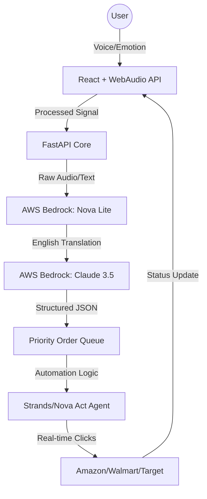

# 🧬 AIVA: AI-Integrated Voice Assistant
### *The Future of Inclusive E-Commerce Automation*

[](https://opensource.org/licenses/Apache-2.0)
[](https://www.python.org/)
[](https://reactjs.org/)
[](https://aws.amazon.com/bedrock/)

**AIVA** (AI-Integrated Voice Assistant) is a production-grade, voice-first e-commerce automation platform. While standard shopping tools focus on speed, AIVA focuses on **Digital Dignity**. It is specifically architected to bridge the accessibility gap for elderly individuals and people with physical or cognitive disabilities, using the world's most advanced Generative AI from AWS.

---

## 🌟 Elite Accessibility Features (Unique to AIVA)
AIVA introduces world-first features designed to handle the nuances of accessibility that standard "Voice Search" ignores:

### 1. 🎭 Proactive Emotional Empathy
Real-time vocal frequency analysis via the **Web Audio API**. AIVA detects user stress, hesitation, or urgency. 
- **Effect:** If the user sounds stressed, the UI automatically simplifies, the agent's tone softens, and confusing elements are hidden to reduce cognitive load.

### 2. 📊 Retailer Accessibility Scoreboard
A live, global ranking system of major e-commerce platforms.
- **Why it matters:** Many shops are "AI-hostile." AIVA audits retailers like Amazon, Target, and Walmart, grading them (A+ to F) on their DOM clarity and voice-compatibility, steering vulnerable users toward safer, more accessible digital environments.

### 3. 📳 Visual Haptic Feedback (For Hearing Impaired)
Sound is transformed into light.
- **The "Haptic Halo":** When AIVA speaks, the microphone interface erupts into a pulsing, glowing ring. This provides a clear visual signal of audio activity for users with hearing loss.

### 4. 🔍 Dynamic Line Magnifier (For Low Vision)
Context-aware focal zoom.
- **How it works:** As the user speaks about a specific item (e.g., "Set the **quantity** to two"), AIVA instantly detects the context and magnifies that specific field in the Order Details matrix to 108% scale with a purple glow.

### 5. 💡 Contextual Shopping "Cheat-Sheet"
Memory support through floating "Idea Bubbles."
- **Support:** For users with early cognitive decline or memory loss, AIVA provides gentle, non-intrusive floating prompts suggesting what they can say next, keeping the conversation flowing.

---

## ☁️ The AWS Powerhouse (Core Brain)
AIVA is built from the ground up to leverage the full **AWS Bedrock** ecosystem for reliability and speed:

| Service | Model / Implementation | Purpose |
| :--- | :--- | :--- |
| **Amazon Bedrock** | Unified Model Access | Securely orchestrating Claude and Nova models at scale. |
| **Amazon Nova Lite** | `amazon.nova-lite-v1` | Powers the **Multilingual Translation Layer** (Hindi, Spanish, French). |
| **Anthropic Claude 3.5** | `claude-3-5-sonnet` | The high-reasoning engine that parses voice to structured order data. |
| **Amazon Nova Sonic** | Bidirectional Audio | (Experimental) Low-latency speech-to-speech interaction. |
| **AWS SDK (Boto3)** | Python Integration | Reliable communication between our FastAPI backend and AWS Cloud. |

---

## 🏗️ Architecture
AIVA uses a **Decoupled Agentic Architecture**, separating sensory input (Voice/UI) from reasoning (LLMs) and action (Browser Automation).

### High-Level Flow


---

## 🛠️ Technology Stack

### Backend (Python/FastAPI)
- **FastAPI:** High-performance REST & WebSocket API.
- **SQLAlchemy:** Secure local/remote database management.
- **Uvicorn:** ASGI server for handling real-time voice streams.
- **Pydantic V2:** Strict data validation for order safety.

### Frontend (React/Cloudscape)
- **AWS Cloudscape:** Professional, data-rich UI component library.
- **Web Audio API:** Real-time frequency analysis for emotional sensing.
- **Text-to-Speech (TTS):** Native browser synthesis with multilingual support.
- **Axios:** Reliable, intercepted HTTP client.

---

## 🚀 Getting Started

### Prerequisites
- Python 3.10+
- Node.js 18+
- AWS Account with Bedrock Access

### 1. Backend Setup
```bash
cd backend
pip install -r requirements.txt
# Configure your .env file with AWS_ACCESS_KEY_ID, AWS_SECRET_ACCESS_KEY, and AWS_REGION
uvicorn app:app --reload --port 8000
```

### 2. Frontend Setup
```bash
cd frontend
npm install
npm run dev
```

---

## 📖 Usage Guide: The AIVA Mission
1.  **Launch the Dashboard:** Navigate to `localhost:3000`.
2.  **Verify Hardware:** Click "Voice Assistant" and grant microphone permissions.
3.  **Start Shopping:** Say *"I want to buy a pair of running shoes"* in English, Hindi, Spanish, or French.
4.  **Observe Empathy:** Note how the UI reacts to your voice. Use the "Retailer Scoreboard" to find the most accessible store for your needs.
5.  **Review & Submit:** AIVA handles the complex navigation; you simply review the magnified details and confirm.

---

## 🏆 Competitive Edge for AI Bharat
AIVA is not just solving a shopping problem; it is solving a **Human Dignity** problem. By combining **AWS Bedrock's** raw power with a frontend that deeply understands human emotion and physical limitations, we demonstrate the true potential of AI: making the world more accessible for *everyone*.

**Built for the AI Bharat Hackathon with ❤️ by Team AIVA.**
