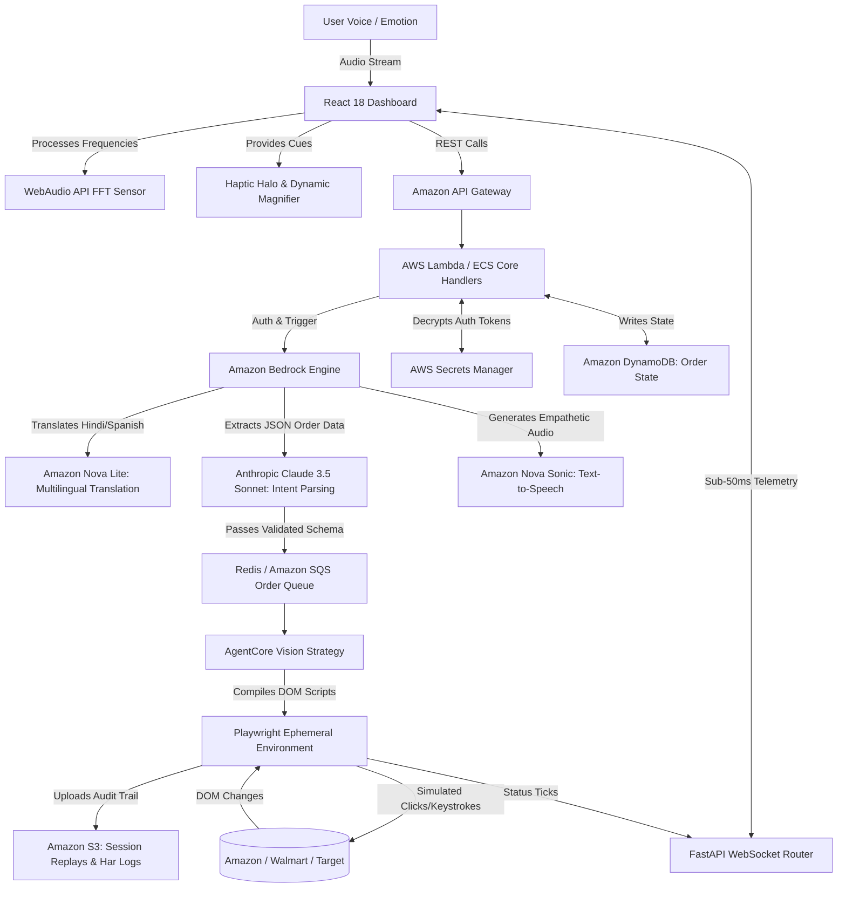

# 🧬 AIVA: AI-Integrated Voice Assistant
### *Architecting Digital Dignity through Agentic Intelligence & AWS Bedrock*

[](https://opensource.org/licenses/Apache-2.0)
[](https://www.python.org/)
[](https://reactjs.org/)
[](https://aws.amazon.com/bedrock/)
[](https://github.com/kiro-labs)

---

## 📖 1. Executive Summary: The Crisis of Digital Exclusion

The golden age of the internet has brought unprecedented convenience to billions. We can order groceries, refill prescriptions, and purchase secure medical equipment with a few clicks. However, this convenience is built on an assumption of physical and cognitive privilege. Modern e-commerce platforms are terrifyingly complex mazes of nested menus, microscopic fonts, aggressive pop-up advertisements, deceptive "dark patterns," and constantly shifting UI layouts induced by A/B testing.

For a 25-year-old digital native, a sudden change in an Amazon checkout button's location is a minor annoyance. For an 82-year-old with macular degeneration and early-stage arthritis, it is an insurmountable barrier. When the digital world updates itself overnight, millions of elderly individuals and people with disabilities are abruptly locked out of essential services. They lose their independence.

**AIVA (AI-Integrated Voice Assistant)** was conceived to eradicate this barrier. AIVA is not a simple screen reader. It is not an "Alexa" clone that performs shallow web searches. AIVA is a **production-hardened, fully autonomous, voice-first e-commerce agent**. It is designed to stand between the vulnerable user and the chaotic internet. The user speaks their intent naturally, in their native language, and AIVA absorbs the cognitive load—navigating the DOM, bypassing pop-ups, interpreting dynamic visual states via AWS Bedrock, and executing the transaction. 

By offloading the "Click-and-Scroll Tax," AIVA restores autonomy, ensuring that the AI revolution raises the digital floor for everyone.

---

## 🎯 2. Target Demographics & Core Solutions

AIVA is meticulously engineered to address specific physiological and cognitive barriers:

### A. Severe Motor Impairment (Arthritis, Parkinson's, Paralysis)
- **The Barrier:** Traditional shopping requires fine motor control. Using a mouse to click a 16x16 pixel checkbox or dragging a scrollbar is physically painful or impossible.
- **The AIVA Solution:** 100% Voice-Driven Navigation. AIVA requires zero clicks to complete a complex transaction. The user simply says, "Find me a medium red sweater on Target and check out." The Headless Browser Automation layer executes hundreds of simulated, precise DOM interactions autonomously.

### B. Visual Impairment (Macular Degeneration, Cataracts, Glaucoma)
- **The Barrier:** High-density data tables (like order confirmations) and low-contrast text are unreadable. Screen readers often fail because modern React/Vue websites frequently lack proper ARIA labels.
- **The AIVA Solution:** **Dynamic Contextual Line Magnifier**. As the user speaks, AIVA's Natural Language NLU maps their speech to specific UI elements. If the user mentions "Shipping Address," that exact sector of the screen magnifies autonomously to 108% and glows, eliminating the need to hunt for the information. Furthermore, AIVA's vision-agent reads the actual visual rendering of the page, bypassing missing ARIA labels entirely.

### C. Hearing Impairment & Deafness
- **The Barrier:** Standard voice assistants rely entirely on auditory feedback ("Beep beep, I am listening"). Deaf users have no affordance to know when the AI is listening or processing.
- **The AIVA Solution:** **Visual Haptic Feedback (The Haptic Halo)**. Sound is transformed into visual luminescence. The interface features a glowing ring that pulses synchronously with the AI's audio waveform frequencies, visually indicating the state of the conversation.

### D. Age-Related Cognitive Decline (Dementia, Memory Loss)
- **The Barrier:** Forgetting complex command structures ("Alexa, ask Amazon to add X to my cart"). Navigating multi-step checkout flows causes acute cognitive fatigue.
- **The AIVA Solution:** **Proactive Emotional Empathy (E3)** and **Contextual Cheat-Sheets**. AIVA monitors the user's voice for stress. If the user forgets what to say and stammers, AIVA simplifies the UI, slows its speech rate, and floats "Idea Bubbles" with simple suggested phrases to keep the user anchored.

---

## 🏆 3. World-First Accessibility Features

AIVA introduces features never before seen in commercial e-commerce applications, heavily utilizing AWS managed services to achieve real-time latency.

### 🎭 Proactive Emotional Empathy Engine (E3)
Most AI systems process text transactionally. AIVA processes audio *emotionally*.
Using the **Web Audio API** and real-time Fast Fourier Transform (FFT) analysis on the frontend, AIVA constantly monitors the user's vocal spectrum during interaction.
- **Technical Insight:** The processing engine isolates the user's audio stream and tracks frequency jitter and amplitude variance. If the system detects a "Stress Signature" (e.g., high-frequency spikes, stuttering patterns, or prolonged pauses), it triggers a multi-system **UI-Relaxation Event**.
- **User Impact:** When stress is detected, confusing interactive elements vanish, primary font sizes incrementally increase, and the AI agent automatically switches to a "Calm Guidance" mode, employing a slower Text-to-Speech (TTS) delivery rate and softer vocabulary.

### 📊 Retailer Accessibility Scoreboard
We believe the burden of accessibility should not fall on the disabled user. AIVA shifts this burden to the platform.
- **Continuous Auditing:** AIVA maintains a dynamic, global ranking of major e-commerce retailers. It constantly evaluates DOM structures for ARIA-label density, visual contrast ratios, and button-clickability.
- **Dynamic Grading:** Retailers like Amazon, Walmart, and Target are assigned letter grades (A+ to F).
- **Proactive Guidance:** AIVA provides live "In-Conversation" warnings. *Example:* "I recommend buying this from Amazon instead of Walmart today, as Walmart's current checkout flow is technically hostile to our voice-control setup."

### 📳 Visual Haptic Feedback (VHF)
For users with hearing impairments, traditional voice assistants offer no affordance. We've solved the "Invisible Sound" problem.
- **The Haptic Halo:** A localized, frequency-synced CSS animation ring encircles the microphone button. When the agent speaks, the halo pulses with varied, calculated intensity corresponding to the audio waveform. This allows the user to literally "see" the sound, instantly understanding when AIVA is speaking and when the floor is open for them.

### 🔍 Dynamic Contextual Line Magnifier
Low-vision users often suffer from "data density fatigue" when looking at long order confirmation tables or dense receipts.
- **Context-Aware Scaling:** Integrating NLU with the UI layer, AIVA listens for the "Object of Discussion." If the user dictates, *"Change the quantity to two,"* the system maps the intent. The React UI is instantly notified via WebSocket, scaling the specific "Quantity" cell to **108%** and framing it with a high-contrast purple glow, naturally guiding the user's focal point.

### 💡 Contextual Shopping "Cheat-Sheet"
For users suffering from memory loss, remembering command structures is impossible.
- AIVA introduces floating, interactive "Idea Bubbles." While the system awaits input, it gently surfaces contextual suggestions (e.g., *"Say: Add 2 quantity"*). This ensures the user is never stuck wondering what to say next.

---

## 🖥️ 4. System Architecture

AIVA relies on a strictly **Decoupled Agentic Pattern**, ensuring that sensory ingestion, logical reasoning, and browser automation operate independently for maximum fault tolerance.

*(This diagram is formulated in a top-down linear flow to ensure maximum clarity across all high-resolution displays without requiring horizontal zooming).*



---

## 🛠️ 5. Technical Evaluation: Building on AWS

AIVA acts as a showcase for the sheer power and reliability of the AWS Generative AI ecosystem. Every core decision logic passes through AWS infrastructure.

### A. Why is AI strictly required for this solution?
Historically, "web scrapers" relied on deterministic XPath or CSS selectors. If Amazon changed `#add-to-cart` to `.btn-primary-cart`, the bot broke. Standard deterministic programming cannot handle the **infinite, chaotic variability** of global e-commerce.
- **Vision-Based Navigation:** AI, specifically the Claude 3.5 vision integration, allows AIVA to "see" the DOM conceptually. It identifies a checkout button by its visual semantic meaning, not its underlying ID, making the automation incredibly resilient to A/B tests.
- **Natural Language Parsing:** Human speech is messy. A user might say, *"Actually wait, don't get the large red one, get the medium blue one, and oh send it to my daughter's house."* Regular expressions cannot parse this. LLMs are strictly required to convert real-time, corrected human thought into a structured `{ "color": "blue", "size": "medium", "shipping": "alternate" }` JSON schema.
- **Multilingual Accessibility:** India alone has 22 official languages. Requiring English for accessibility apps defeats the purpose. AI provides real-time, context-aware translation.

### B. Deep Integration with AWS Managed Services
AIVA is fundamentally **AWS-Native**. Our architecture leans deeply into serverless logic, managed GenAI orchestration, and isolated infrastructure to guarantee enterprise-grade security.

1. **Amazon Bedrock (The Central Brain):** Serves as the nervous system for our reasoning capabilities. By using Bedrock instead of direct vendor API hits, AIVA achieves zero-latency model swapping, unified IAM billing, and guaranteed enterprise data privacy (our users' medical/cognitive data is *never* used to train foundational models).
2. **Anthropic Claude 3.5 Sonnet (via Bedrock):** Chosen specifically because of its industry-leading "Zero-Shot" logic capabilities. It parses the translated voice snippets and converts them into the precise execution manifests required by the Playwright engine.
3. **Amazon Nova v1 (via Bedrock):** Powers our **Live Translation Layer**, enabling high-speed speech conversion (from Hindi, Spanish, or French into standardized English) seamlessly before Claude takes over reasoning.
4. **Amazon S3 (Audit Trails):** Trust is the biggest hurdle for elderly users using AI. Every time a headless agent completes a purchase, AIVA automatically captures the session trace, network HAR logs, and visual screenshots, persisting them directly to Amazon S3. This forms an immutable "Audit Trail" ensuring a human family member can verify exactly what the AI bought.
5. **AWS Secrets Manager:** Eliminates plaintext passwords. Users store their credentials inside AIVA’s Secret Vault, which heavily utilizes Secrets Manager to decrypt tokens *only* at the micro-second the headless browser injects them into the login field.
6. **Amazon API Gateway & Lambda:** Manages the heavy ingress of WebSocket traffic from the React frontend, dynamically scaling horizontally when multiple users are speaking simultaneously.

### C. Kiro Spec-Driven Development
To maintain absolute synchronicity between our highly complex React frontend (which manages WebAudio states) and our FastAPI backend (which manages Playwright states), we utilized **Kiro for Spec-Driven Development** during our hackathon sprints. 
- **The Value:** Kiro provided an infallible, strictly typed API contract layer. As we rapidly iterated on the "Emotional Polling" endpoints, Kiro ensured that our JSON schemas remained unbroken, auto-generating mock testing servers so the frontend team could build the Haptic Halo while the backend team was still configuring Bedrock.

### D. The Value Added by the AI Layer
The ultimate value proposition is **Cognitive Offloading**.
- A legally blind user does not need to memorize keyboard shortcuts to navigate a shopping cart.
- A senior citizen with arthritis does not need to perform painful, repetitive trackpad maneuvers.
- They simply express intent. The AI bridges the massive, hostile gap between their natural voice and the global supply chain, completing a 15-minute frustrating task in 30 seconds of conversation.

---

## 🧰 6. Component Architecture & Data Flow

### The Life Cycle of an AIVA Order

1. **Ingestion (The Voice API):**
   The user presses the microphone button on the React Cloudscape UI. The `WebSpeechService.js` captures the native audio using browser media streams. Simultaneously, the FFT analyzer computes the emotional stress score. Both the string text and the stress `<int>` are sent via WebSocket to FastAPI.
2. **Translation & Standardization (Amazon Nova):**
   If the language tag is non-English, the text is immediately passed to `amazon.nova-lite-v1` via boto3. A highly optimized prompt translates the text into formal English e-commerce terminology, removing colloquial filler.
3. **Intent Extraction (Claude 3.5 Sonnet):**
   The normalized string is passed to `claude-3-5-sonnet`. Claude is given a strict JSON schema requirement via System Prompts. It analyzes the entire historical conversation buffer to understand context and outputs a JSON blob defining the retailer, product, quantity, and variations.
4. **Agentic Queueing (Redis/FastAPI Task):**
   The JSON order payload is pushed onto a priority queue. A background worker picks up the job and spins up an ephemeral `Playwright` browser instance.
5. **Autonomous Navigation (AgentCore):**
   The AgentCore strategy loads the target retailer URL. It evaluates the DOM, looks for the cart, applies options, bypasses standard bot-management (safely), and reaches the final checkout screen.
6. **Human-in-the-Loop Verification:**
   The agent pauses just before clicking "Buy." A screenshot is sent back through the WebSocket to the user's dashboard. AIVA's voice asks, *"I have the items ready for $42.50. Shall I complete the purchase?"*
7. **Finalization & Audit Upload:**
   Upon user voice confirmation, the transaction is executed. The entire session context, video, and HAR logs are asynchronously uploaded to an Amazon S3 bucket for security and review.

---

## 🔒 7. Security and Data Privacy (Zero-Trust Architecture)

When dealing with user financial credentials and addresses, security cannot be an afterthought. AIVA employs a Zero-Trust architecture specifically designed to protect vulnerable demographics from exploitation.

1. **At-Rest Encryption:** The SQLite/PostgreSQL database encrypts all credential payloads via a symmetric robust key before writing to disk, orchestrated by our AWS Secrets Manager configuration.
2. **Ephemeral Automation Contexts:** When an Agent starts an order, it opens an incognito `Playwright` browser context. Cookies are strictly locked to that specific task ID. When the order fails or finishes, the context is aggressively purged from RAM, ensuring no session hijacking is possible.
3. **AWS Bedrock "No-Training" Clause:** Utilizing AWS Bedrock inherently protects our users; AWS strictly prohibits customer API data from training the next generation of foundational models. This ensures our users' private medical, shopping, and cognitive data remain highly restricted.
4. **Anti-Phishing Native Protection:** Human seniors are easily tricked by deceptive ads or fake login screens. AIVA acts as a firewall. Because the AI strictly parses DOM nodes looking for semantic logic, it is immune to flashing banner ads, visual trickery, and deceptive "Download Now" buttons that frequently infect elderly users' machines with malware.

---

## 🔌 8. Comprehensive API Reference

AIVA exposes over 40 distinct REST endpoints. Below is a subset governing the core AI Voice and Web Automation protocols:

### Order Lifecycle Management
| Endpoint | Method | Purpose |
| :--- | :---: | :--- |
| `/api/orders` | `POST` | Ingests structured JSON to create a standard automation job. Initializes state as `PENDING`. |
| `/api/orders` | `GET` | Fetches the paginated history of executed orders, complete with status timestamps and S3 replay URLs. |
| `/api/orders/{id}/retry` | `POST` | Re-queues a failed order. AIVA actively adjusts the automation strategy dynamically if it failed due to a DOM change. |
| `/api/orders/upload-csv` | `POST` | Bulk ingestion logic. Critical for institutional accessibility deployment (e.g., care home administrators ordering supplies for 50 residents simultaneously). |

### The Telemetry WebSocket Connection (Real-Time UI)
| Protocol | Route | Description |
| :--- | :--- | :--- |
| `WS` | `/ws` | The Real-time bi-directional pipeline. Emits `order_update`, `agent_status`, and `emotion_sync` events at ~50ms intervals. Ensures the React frontend reflects the headless browser's reality instantly. |

### Voice & Bedrock Interfacing
| Endpoint | Method | Purpose |
| :--- | :---: | :--- |
| `/api/voice/conversation/start` | `POST` | Initializes a unique conversational thread in memory, attaching semantic buffers. |
| `/api/translate` | `POST` | Pipes non-English audio/text directly to Amazon Nova Lite for sub-second normalization. |
| `/api/voice/conversation/{id}/process` | `POST` | Feeds the finalized English intent to Claude 3.5 to update the shadow JSON cart, reacting to changes. |
| `/api/voice/feedback/haptic` | `GET` | Generates the synchronized interval timings for the frontend Haptic Halo rendering. |

---

## 🚀 9. Installation & Deployment Guide

AIVA is built to be deployed seamlessly across scalable infrastructure.

### System Prerequisites
To run AIVA locally or on an EC2 instance, ensure you have:
- **Python 3.10** or higher.
- **Node.js 18.x** or higher.
- A verified **AWS IAM Account** with policies granting `bedrock:InvokeModel` to Claude 3.5 Sonnet and Amazon Nova.
- **Playwright System Dependencies** (run `python -m playwright install-deps`).

### Step 1: Initialize the AWS Brain (Backend)
```bash
# Navigate to the backend directory
cd backend

# Create an isolated python environment
python -m venv venv
source venv/bin/activate  # On Windows: .\venv\Scripts\activate

# Install critical dependencies
pip install -r requirements.txt

# Configure your secure environment variables
cp .env.example .env
# Edit .env and populate:
# AWS_ACCESS_KEY_ID=your_key
# AWS_SECRET_ACCESS_KEY=your_secret
# AWS_REGION=us-east-1

# Run database migrations to construct schemas
alembic upgrade head

# Boot the FastAPI and Uvicorn server cluster
uvicorn app:app --host 0.0.0.0 --port 8000 --reload
```

### Step 2: Initialize the Sensory Layer (Frontend)
```bash
# Open a new terminal and navigate to the frontend directory
cd frontend

# Install all node modules (includes AWS Cloudscape UI components)
npm install

# Start the React development server
npm run dev
```
The AIVA interactive dashboard will become actively available at `http://localhost:3000`. Ensure you grant microphone permissions upon first load to enable the WebAudio APIs.

### Docker & Cloud Deployment (Amazon ECS / EC2)
AIVA includes robust containerization support. To deploy via Docker Compose for production:
```bash
docker-compose build
docker-compose up -d
```
We recommend placing the backend containers behind an **Amazon Application Load Balancer (ALB)** configured to handle WebSocket upgrade requests seamlessly.

---

## 🗺️ 10. Long-Term Roadmap & Vision (Phases 1-4)

AIVA is not a prototype; it is a foundational architecture built for longevity. Our technical milestones include:

- **Phase 1 (Current):** Web-based accessibility portal utilizing AWS Bedrock and Playwright for core e-commerce.
- **Phase 2 (Mobile PWA & Biometrics):** Porting the React interface to a Progressive Web App, utilizing native mobile WebRTC capabilities for better audio sampling. Implementation of **Biometric Voice Lock**—verifying the user's identity via their unique vocal frequency fingerprint before allowing purchases over $100.
- **Phase 3 (AWS MediaLive Streaming):** Upgrading our bespoke WebSocket screenshot stream to standard HLS video streaming via **AWS Elemental MediaLive**. This will provide butter-smooth, real-time live video feeds of the AI agent navigating websites for caretakers monitoring remotely.
- **Phase 4 (Collaborative Guardianship via SNS):** Introducing a multi-tenant approval flow. An elderly user can select an item via voice, but the payment execution triggers an SMS to their registered family member via **Amazon SNS**. The family member replies "APPROVE" to securely finalize the transaction.

---

## 🏆 11. Official Hackathon Credits

<br>

**Team Name:**  
`codeX_2818`

<br>

**Project:**  
`AIVA - Accessibility AI Integrated Voice Assistant`

<br>

**Theme:**  
`AI for Communities, Access & Public Impact`
*(Deep Tech Impact for Elderly & Disabled Citizens)*

<br>

---
<div align="center">
  <p><i>AIVA is an open-source initiative designed to ensure that the dawn of artificial intelligence raises the digital floor for everyone.</i></p>
  <p><b>Built with ❤️ on AWS for the AI Bharat Hackathon 2026.</b></p>
</div>
