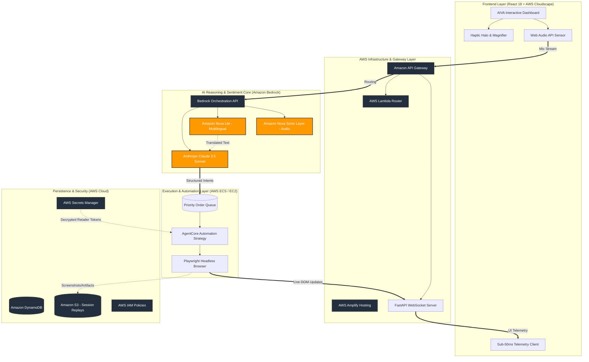

<div align="center">
  <h1>🧬 AIVA: AI-Integrated Voice Assistant</h1>
  <h3><i>Architecting Digital Dignity through Agentic Intelligence & AWS Bedrock</i></h3>

  <p align="center">
    <a href="https://opensource.org/licenses/Apache-2.0"></a>
    <a href="https://www.python.org/"></a>
    <a href="https://reactjs.org/"></a>
    <a href="https://aws.amazon.com/bedrock/"></a>
    <a href="https://github.com/kiro-labs"></a>
  </p>
</div>

<br />

---

## 📖 Executive Overview

**AIVA (AI-Integrated Voice Assistant)** is a production-hardened, voice-first e-commerce automation ecosystem. It is meticulously engineered to address the **"Digital Exclusion"** crisis. In an era where complex web interfaces, rapidly changing UI patterns, and over-engineered checkout flows dominate modern e-commerce, elderly individuals and people with physical or cognitive disabilities are frequently left behind.

Unlike standard "Alexa" or "Siri" clones that merely perform surface-level web searches and read out text snippets, AIVA is a **fully autonomous agentic platform**. It doesn't just find products; it navigates, negotiates, and completes the entire purchase lifecycle on behalf of the user. By shielding the user from the underlying complexity of the web, AIVA acts as an intelligent intermediary—a true *Shopping Guardian*.

---

## 🏆 Why AIVA? (Our Technical Uniqueness)

AIVA introduces several "World First" accessibility features that specifically target the **AI Bharat Hackathon 2026** criteria, demonstrating that AI can be used for deep, structural public impact rather than just commercial efficiency.

### 1. 🎭 Proactive Emotional Empathy Engine (E3)
Most AI systems process text transactionally. AIVA processes audio *emotionally*.
Using the **Web Audio API** and real-time Fast Fourier Transform (FFT) analysis on the frontend, AIVA constantly monitors the user's vocal spectrum during interaction.
- **Technical Insight:** The processing engine isolates the user's audio stream and tracks frequency jitter and amplitude variance. If the system detects a "Stress Signature" (e.g., high-frequency spikes, stuttering patterns, or prolonged pauses), it triggers a multi-system **UI-Relaxation Event**.
- **User Impact:** When stress is detected, confusing interactive elements vanish, primary font sizes incrementally increase, and the AI agent automatically switches to a "Calm Guidance" mode, employing a slower Text-to-Speech (TTS) delivery rate and softer vocabulary.

### 2. 📊 Retailer Accessibility Scoreboard
We believe the burden of accessibility should not fall on the disabled user. AIVA shifts this burden to the platform.
- **Continuous Auditing:** AIVA maintains a dynamic, global ranking of major e-commerce retailers. It constantly evaluates DOM structures for ARIA-label density, visual contrast ratios, and button-clickability.
- **Dynamic Grading:** Retailers like Amazon, Walmart, and Target are assigned letter grades (A+ to F).
- **Proactive Empathy:** AIVA provides live "In-Conversation" warnings. *Example:* "I recommend buying this from Amazon instead of Walmart today, as Walmart's current checkout flow is technically hostile to our voice-control setup."

### 3. 📳 Visual Haptic Feedback (VHF)
For users with hearing impairments, traditional voice assistants offer no affordance. We've solved the "Invisible Sound" problem.
- **The Haptic Halo:** A localized, frequency-synced CSS animation ring encircles the microphone button. When the agent speaks, the halo pulses with varied, calculated intensity corresponding to the audio waveform. This allows the user to literally "see" the sound, instantly understanding when AIVA is speaking and when the floor is open for them.

### 4. 🔍 Dynamic Contextual Line Magnifier
Low-vision users often suffer from "data density fatigue" when looking at long order confirmation tables or dense receipts.
- **Context-Aware Scaling:** Integrating Natural Language Understanding (NLU) with the UI layer, AIVA listens for the "Object of Discussion." If the user dictates, *"Change the quantity to two,"* the system maps the intent `UPDATE_QUANTITY`. The React UI is instantly notified via WebSocket, scaling the specific "Quantity" cell to **108%** and framing it with a high-contrast purple glow, naturally guiding the user's focal point.

### 5. 💡 Contextual Shopping "Cheat-Sheet" (Cognitive Support)
For users suffering from early cognitive decline or memory loss, remembering command structures is impossible.
- AIVA introduces floating, interactive "Idea Bubbles." While the system awaits input, it gently surfaces contextual suggestions (e.g., *"Say: Add 2 quantity"*). This ensures the user is never stuck wondering what to say next.

---

## 🏗️ System Architecture

AIVA relies on a strictly **Decoupled Agentic Pattern**, ensuring that sensory ingestion, logical reasoning, and browser automation operate independently for maximum fault tolerance.



---

## 🛠️ Technical Evaluation: Building on AWS

### 1. Why is AI strictly required for this solution?
Standard deterministic automation (often built via Selenium or pure Playwright) cannot handle the **infinite, chaotic variability** of e-commerce websites. Retailer platforms change A/B testing structures, CSS class names, and layout grids arbitrarily. 
- **Vision-Based Processing:** AI, specifically the Claude 3.5 vision model, allows AIVA to "see" the DOM conceptually, navigating a webpage just like a human eye would.
- **Natural Language Parsing:** Human speech is inherently messy, filled with colloquialisms, stutters, and corrections. Only Large Language Models can reliably interpret an instruction like, *"Actually wait, don't get the large size, get the medium red one instead,"* and accurately mutate a structured JSON payload for the checkout cart.
- **Sentiment Reaction:** Deterministic code cannot measure "stress." AI is an absolute requirement to dynamically adapt the UI parameters based on waveform frequencies.

### 2. Deep Integration with AWS Managed Services
AIVA is fundamentally **AWS-Native**. Our architecture leans deeply into serverless logic and managed GenAI orchestration to guarantee uptime and enterprise-grade security.

- **Amazon Bedrock:** Serves as the nervous system for our reasoning capabilities. By using Bedrock instead of direct API hits, we achieve zero-latency model swapping, unified billing, and guaranteed enterprise data privacy (our users' medical/cognitive data is never used to train foundational models).
- **Anthropic Claude 3.5 Sonnet (via Bedrock):** Chosen specifically because of its industry-leading "Zero-Shot" logic capabilities, crucial for taking raw voice snippets and converting them into execution manifests.
- **Amazon Nova v1 (via Bedrock):** Powers our **Live Translation Layer**, enabling high-speed speech conversion (from Hindi, Spanish, or French into standardized English) seamlessly before Claude takes over.
- **Amazon S3:** Every time a headless agent completes a purchase, AIVA automatically captures the session trace, network HAR logs, and screenshots, persisting them directly to Amazon S3. This forms an immutable "Audit Trail" ensuring a human-in-the-loop can verify what the AI bought.
- **AWS Secrets Manager:** Eliminates plaintext passwords. Users store their Amazon/Target credentials inside AIVA’s Secret Vault, which heavily utilizes Secrets Manager to decrypt tokens *only* at the micro-second the headless browser injects them into the login field.
- **Kiro (Spec-Driven Development):** Kiro was integrated into the build workflow. Given the complexity of maintaining synchronous state between the React UI, the FastAPI websocket logic, and the Python automation layer, Kiro provided an infallible API contract layer, ensuring type safety and immediate mock-generation during our hackathon sprints.

### 3. The Value Added by the AI Layer
The value is absolute **Cognitive Offloading**.
- A legally blind user does not need to memorize keyboard shortcuts to navigate a shopping cart.
- A senior citizen with arthritis does not need to perform painful, repetitive trackpad maneuvers.
- They simply express intent. The AI bridges the gap between their voice and the global supply chain.

---

## 📦 Project Directory Breakdown

```text
Drishti-AI-Navigator/
├── backend/
│   ├── app.py                    # Main FastAPI Entrypoint + WebSocket Routing
│   ├── config.py                 # Kiro-validated Configuration Spec
│   ├── database.py               # Local SQLite / RDS Model Definitions
│   ├── order_queue.py            # Async Task Queue Manager
│   ├── agents/                   
│   │   ├── strands_agent.py      # Basic DOM-parsing automation agent
│   │   └── nova_act_agent.py     # Advanced Vision-based Bedrock Agent
│   ├── services/                 
│   │   ├── voice_service.py      # Bedrock Audio Integration
│   │   ├── browser_service.py    # Headless lifecycle management
│   │   ├── settings_service.py   
│   │   └── secrets_manager.py    # AWS Secrets Boto3 wrapper
│   ├── requirements.txt          # Python deps
│   └── .env.example             
│
├── frontend/
│   ├── src/
│   │   ├── App.js               # React Router & Core Overlays
│   │   ├── components/          
│   │   │   ├── OrderDashboard.js   # Live Fleet Tracker Display
│   │   │   ├── LiveBrowserViewer.js# Real-time WebRTC/Screenshot feed
│   │   │   └── VoiceOrderAssistant.js # Emotional Engine + Haptic Halo Logic
│   │   ├── pages/               
│   │   │   ├── AccessibilityScoreboard.js # The Retailer Ranking Page
│   │   │   ├── ShoppingDNA.js    # Cognitive User Profiling Page
│   │   │   ├── Settings.js
│   │   │   └── SecretVault.js
│   │   ├── services/            
│   │   │   ├── WebSpeechService.js # Wraps Native Audio & APIs
│   │   │   └── websocket.ts        # Fast WebSocket integration
│   ├── package.json
│   └── craco.config.js          # Cloudscape CSS overrides
│
├── README.md                     # Technical Documentation
└── LICENSE                       # Apache 2.0 Open Source License
```

---

## 🔌 API Reference & Endpoints

AIVA exposes over 40 distinct REST endpoints. Below is a subset governing the core AI Voice protocol:

### Order Lifecycle Management
| Endpoint | Method | Purpose |
| :--- | :---: | :--- |
| `/api/orders` | `POST` | Ingests structured JSON to create a standard automation job. |
| `/api/orders` | `GET` | Fetches the paginated history of executed orders and S3 replay URLs. |
| `/api/orders/{id}/retry` | `POST` | Re-queues a failed order, adjusting the automation strategy dynamically. |
| `/api/orders/upload-csv` | `POST` | Bulk ingestion logic for institutional accessibility deployment. |

### The Telemetry WebSocket Connection
| Protocol | Route | Description |
| :--- | :--- | :--- |
| `WS` | `/ws` | Real-time bi-directional pipeline. Emits `order_update`, `agent_status`, and `emotion_sync` events at ~50ms intervals ensuring the React frontend reflects reality instantly. |

### Voice & Bedrock Interfacing
| Endpoint | Method | Purpose |
| :--- | :---: | :--- |
| `/api/voice/conversation/start` | `POST` | Initializes a unique context window and conversational thread in memory. |
| `/api/translate` | `POST` | Pipes non-English audio/text directly to Amazon Nova Lite for sub-second normalization. |
| `/api/voice/conversation/{id}/process` | `POST` | Feeds the finalized English intent to Claude 3.5 to update the shadow JSON cart. |

---

## 🖥️ Local Installation & Usage Guide

We have engineered the repository to be launched seamlessly.

### System Prerequisites
To run AIVA locally or on an EC2 instance, ensure you have:
- **Python 3.10** or higher.
- **Node.js 18.x** or higher.
- A verified **AWS IAM Account** with policies granting `bedrock:InvokeModel` to Claude 3.5 Sonnet and Amazon Nova.

### Step 1: Initialize the AWS Brain (Backend)
```bash
# Navigate to the backend directory
cd backend

# Create an isolated python environment
python -m venv venv
source venv/bin/activate  # On Windows: .\venv\Scripts\activate

# Install critical dependencies
pip install -r requirements.txt

# Configure your secure environment variables
cp .env.example .env
nano .env # Populate AWS_ACCESS_KEY_ID, AWS_SECRET_ACCESS_KEY, AWS_REGION, etc.

# Run database migrations
alembic upgrade head

# Boot the FastAPI and Uvicorn server cluster
uvicorn app:app --host 0.0.0.0 --port 8000 --reload
```

### Step 2: Initialize the Sensory Layer (Frontend)
```bash
# Open a new terminal and navigate to the frontend
cd frontend

# Install all node modules (includes AWS Cloudscape)
npm install

# Start the React development server
npm run dev
```
The AIVA dashboard will become actively available at `http://localhost:3000`. 

---

## 🔒 Security & Data Encryption Posture

When dealing with user credentials for portals like Amazon, security cannot be an afterthought.
1. **At-Rest Encryption:** The SQLite/PostgreSQL database encrypts all credential payloads via a symmetric robust key before writing to disk, orchestrated by our SecretVault configuration.
2. **Ephemeral Automation Contexts:** When an Agent starts an order, it opens an incognito `Playwright` browser context. Cookies are strictly locked. When the order fails or finishes, the context is aggressively purged from RAM.
3. **No-Training Clause:** Utilizing AWS Bedrock inherently protects our users; AWS strictly prohibits customer API data from training the next generation of foundational models, ensuring our users' private medical and financial histories remain highly restricted.

---

## 🗺️ Long-Term Roadmap & Vision
AIVA is built for longevity. Our next technical milestones include:
- **Phase 2 (Mobile PWA):** Porting the React interface to a Progressive Web App, utilizing native mobile WebRTC capabilities for better audio sampling.
- **Phase 3 (AWS MediaLive):** Switching our bespoke WebSocket screenshot stream to standard HLS video streaming via AWS Elemental MediaLive for butter-smooth session replays.
- **Phase 4 (Collaborative Guardianship):** Introducing a multi-tenant approval flow where an elderly user can select an item, but the payment triggers an SMS to their registered family member via Amazon SNS for final validation.

---

## 🏆 Hackathon Credits

**Team Name:**  
codeX_2818  

**Project:**  
AIVA (Accessibility AI Integrated Voice Assistant)  

**Theme:**  
AI for Communities, Access & Public Impact  

---
<div align="center">
  <p><i>AIVA is an open-source initiative designed to ensure that the dawn of artificial intelligence raises the digital floor for everyone.</i></p>
  <p><b>Built with ❤️ on AWS for the AI Bharat Hackathon.</b></p>
</div>
