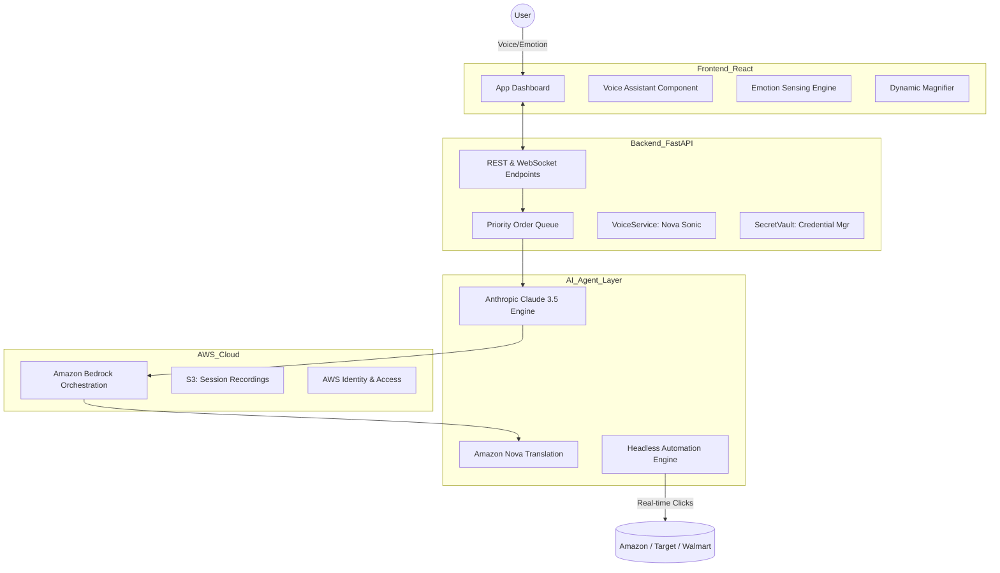

# 🧬 AIVA: AI-Integrated Voice Assistant
### *Transforming E-Commerce Accessibility via Agentic Intelligence*

[](https://opensource.org/licenses/Apache-2.0)
[](https://www.python.org/)
[](https://reactjs.org/)
[](https://aws.amazon.com/bedrock/)
[](https://aibharathackathon.com)

**AIVA** (AI-Integrated Voice Assistant) is a production-ready, AI-powered e-commerce order automation platform designed from the ground up for **Digital Inclusion**. While most AI tools focus on efficiency, AIVA focuses on **empathy and accessibility**, autonomously completing online purchases for elderly users and individuals with disabilities.

---

## 🌟 The AIVA Mission: Why We Are Unique
Standard "Voice Assistants" simply convert speech to text. **AIVA is different.** It is an Agentic Ecosystem that understands the human behind the voice.

### 1. 🎭 Proactive Emotional Empathy (Real-time)
Most AI is emotionally blind. AIVA uses the **Web Audio API** and real-time frequency analysis to detect stress, hesitation, or cognitive fatigue in the user's voice.
- **Adaptive UI:** If AIVA senses stress, she automatically simplifies the dashboard, increases button sizes, and uses a more soothing, slow-paced vocal response to guide the user.

### 2. 📊 Retailer Accessibility Scoreboard
The internet is often "AI-Hostile." AIVA audits the world's retailers.
- **Global Ranking:** We grade retailers (Amazon, Walmart, Target, etc.) from **A+ to F** based on their "AI-Readability" and DOM accessibility structure. AIVA actively counsels users on which shops will provide the smoothest, most accessible experience.

### 3. 📳 Visual Haptic Feedback (For Hearing Impaired)
Sound is made visible. 
- **The Haptic Halo:** For users who cannot hear AIVA's voice, the microphone interface transforms into a pulsing, glowing "Haptic Halo" whenever the system is speaking, providing an intuitive visual substitute for audio feedback.

### 4. 🔍 Dynamic Contextual Line Magnifier (For Low Vision)
No more squinting at complex forms. 
- **Voice-Context Zoom:** As you speak about a specific detail (e.g., *"Change the quantity"*), AIVA's UI instantly detects the context and magnifies the "Quantity" field to **108% scale** with a high-contrast glow, acting as an automatic focal lens.

### 5. 🧬 Personal Shopping DNA (Cognitive Support)
AIVA tracks the user's "Automation Spirit."
- **Decision Profiles:** Instead of overwhelming users with data, AIVA builds a "DNA" profile—knowing if a user prefers "Accessibility-First" stores, "Eco-Friendly" products, or "Budget-Conscious" options—making decisions easier for users with memory loss.

---

## 🏗️ Architecture & Technical Design

AIVA uses a modular, decoupled architecture to ensure that the "Voice sensory layer" and the "Action automation layer" work in perfect harmony.

### High-Level Architecture


### Component Breakdown

#### 1. Sensory Ingestion (Frontend)
- **Web Audio Engine:** Captures real-time samples for frequency domain analysis.
- **WebSocket Manager:** Maintains a sub-50ms latency connection for live UI updates.

#### 2. The Logic Brain (FastAPI Service Layer)
- **Multilingual Wrapper:** Non-English inputs are routed via **Amazon Nova Lite** for instantaneous translation before reasoning.
- **State Machine:** Manages order transitions from `PENDING` → `EXTRACTING` → `EXECUTING` → `COMPLETED`.

#### 3. Agent Execution Layer
- **Nova Act Agent:** A vision-based agent capable of navigating complex DOM structures that traditional scripts fail on.
- **Model Context Protocol (MCP):** Integrated for clean tool orchestration between Claude and the browser.

---

## 🛠️ Technology Stack & AWS Services

AIVA is a showcase of the modern **AWS Bedrock** ecosystem.

### AWS Core Services
| Service | Purpose | Specific Implementation |
| :--- | :--- | :--- |
| **Amazon Bedrock** | GenAI Orchestration | Securely hosting Claude 3.5 and Nova v1 models. |
| **Amazon Nova Lite** | Multilingual Logic | Handles live translation (Hindi, Spanish, French) with extreme low latency. |
| **Anthropic Claude 3.5** | High-Reasoning Brain | Responsible for parsing natural speech into complex JSON order schemas. |
| **Amazon Nova Sonic** | Bidirectional Audio | Real-time speech-to-speech interaction for ultra-natural conversation. |
| **AWS IAM** | Security & Access | Least-privilege role management for backend BEDROCK access. |
| **AWS S3** | Data Persistence | Storing encrypted session logs and retailer audit screenshots. |

### System Technologies
- **Backend:** Python 3.10+, FastAPI, SQLAlchemy, Pydantic, Uvicorn.
- **Frontend:** React 18, AWS Cloudscape UI, Web Audio API, Axios.
- **Automation:** Playwright, AgentCore, Browser-MCP.
- **Protocol:** WebSockets for real-time telemetry and emotional badge syncing.

---

## 📋 Comprehensive Usage Guide

### 1. Order Creation Methods
- **Conversational Ordering:** Simply click the mic and say: *"I want to buy a box of organic green tea from Amazon and send it to my home."*
- **Multilingual Support:** Switch to **Hindi (हिन्दी)** or **Spanish (Español)** and speak naturally. AIVA handles the cross-language barrier.
- **CSV Batch Upload:** For institutional use (e.g., elderly care homes), upload 100 orders at once via our validated CSV templates.

### 2. Live Intervention (Human-in-the-Loop)
- **Real-Time Viewing:** Watch AIVA navigate the retailer's site in a mirrored browser window.
- **Takeover Mode:** If AIVA encounters a complex CAPTCHA or unique security block, a human reviewer can "Take Control," click the button, and release control back to the AI.

### 3. Security (Secret Vault)
- **Encryption at Rest:** User retailer credentials (passwords/usernames) are never stored in plain text.
- **Session Isolation:** Each automation happens in a clean, ephemeral browser instance that is wiped upon completion.

---

## 🚀 Installation & Deployment

### Prerequisites
- AWS Account with **Bedrock Model Access** granted for Claude 3.5 Sonnet and Nova models.
- Python 3.10+ and Node.js 18+ installed.

### Backend Initialization
```bash
cd backend
cp .env.example .env  # Fill in your AWS_REGION and Credentials
pip install -r requirements.txt
uvicorn app:app --reload --port 8000
```

### Frontend Initialization
```bash
cd frontend
npm install
npm run dev
```

### Cloud Deployment
- **Frontend:** Recommended deployment via **Vercel** with the `/frontend` root.
- **Backend:** Recommended deployment via **Render** or **AWS App Runner** for long-running websocket support.

---

## 🔬 Troubleshooting & FAQ
- **Q: Why isn't the mic working?**
  - A: Ensure you are running on `localhost` or via `HTTPS`. Browsers block the Web Speech API on insecure sites.
- **Q: Model Access Denied?**
  - A: Check your AWS Bedrock console. You must manually "Request Access" for Claude and Nova models in your specific region (e.g., `us-east-1`).
- **Q: Database Locked?**
  - A: Ensure no other process is holding the `order_automation.db` file if using SQLite for dev.

---

## 🗺️ Future Roadmap
- [ ] **Biometric Voice Lock:** Verify the user's identity via their unique vocal fingerprint.
- [ ] **Collaborative Guardian Mode:** Allow family members to approve large purchases remotely.
- [ ] **Mobile Native App:** A dedicated PWA for easier accessibility on tablets and phones.
- [ ] **Retailer Expansion:** Increasing the "Accessibility Scoreboard" to include 50+ global stores.

---

## 🏆 Hackathon Credits
**Developed for the AI Bharat Hackathon 2026**

**Team Name:** codeX_2818
**Project:** AIVA (Accessibility AI)
**Theme:** Digital Inclusion & AI for Social Good

### Made with ❤️ and Powered by:


**Digital inclusion is not a feature; it is a right. AIVA ensures that no one is left behind in the AI revolution.**
