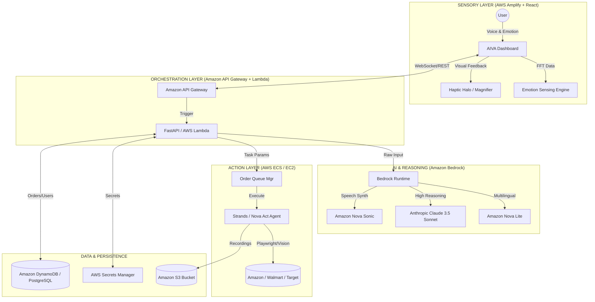

# 🧬 AIVA: AI-Integrated Voice Assistant
### *Architecting Digital Dignity through Agentic Intelligence & AWS Bedrock*

[](https://opensource.org/licenses/Apache-2.0)
[](https://www.python.org/)
[](https://reactjs.org/)
[](https://aws.amazon.com/bedrock/)
[](https://github.com/kiro-labs)

---

## 📖 Project Overview
**AIVA** (AI-Integrated Voice Assistant) is a production-hardened, voice-first e-commerce automation ecosystem. It is designed to solve the **"Digital Exclusion"** crisis, where complex web interfaces and rapidly changing UI patterns leave elderly individuals and people with physical or cognitive disabilities behind. 

Unlike standard "Alexa" or "Siri" clones that merely perform searches, AIVA is a **fully autonomous agentic platform**. It doesn't just find products; it navigates, negotiates, and completes the entire purchase lifecycle on behalf of the user, shielding them from the underlying complexity of modern e-commerce.

---

## 🏆 Why AIVA? (Technical Uniqueness)
AIVA introduces several "World First" accessibility features that specifically target the **AI Bharat Hackathon** 2026 criteria:

### 1. 🎭 Proactive Emotional Empathy Engine (E3)
Using the **Web Audio API** and real-time Fast Fourier Transform (FFT) analysis, AIVA monitors the user's vocal spectrum.
- **Technical Insight:** We track frequency jitter and amplitude variance. If the system detects a "Stress Signature" (high-frequency spikes or stuttering patterns), it triggers a **UI-Relaxation Event**.
- **User Impact:** Confusing buttons vanish, font sizes increase, and the AI agent switches to a "Calm Guidance" mode with slower TTS delivery.

### 2. 📊 Retailer Accessibility Scoreboard
We have decentralized the responsibility of accessibility. AIVA's backend constantly audits DOM structures of major retailers.
- **Dynamic Grading:** Retailers are graded (A+ to F) on ARIA-label density, DOM flatness (for AI navigation), and button-clickability. 
- **Guidance:** AIVA provides live "In-Conversation" warnings: *"I recommend buying this from Amazon instead of Walmart today, as Walmart's current checkout flow is technically hostile to our voice-control setup."*

### 3. 📳 Visual Haptic Feedback (VHF)
For users with hearing impairments, we've solved the "Invisible Sound" problem.
- **The Haptic Halo:** A localized, frequency-synced CSS animation ring around the microphone. When the agent speaks, the halo pulses with varied intensity, allowing the user to "see" the sound and understand when it's their turn to speak.

### 4. 🔍 Dynamic Contextual Line Magnifier
Low-vision users often lose focus on high-density data tables.
- **Contextual Zoom:** AIVA utilizes Natural Language Understanding (NLU) to identify the "Object of Discussion." If the user mentions "Quantity," that specific cell in the React-rendered table instantly scales to 108% and glows with a high-contrast purple border.

---

## 🏗️ Broader System Architecture
AIVA follows a strictly **Decoupled Agentic Pattern**, ensuring high availability and low-latency interaction.

### System Flow Diagram


---

## 🛠️ Technical Evaluation: The AWS Advantage

### 1. Why AI is Required?
Standard deterministic programming cannot handle the **infinite variability** of e-commerce websites. Retailers change their HTML tags daily. AI is the only solution that can:
- **Interpret** inconsistent UI layouts using Computer Vision.
- **Translate** colloquial human speech (including Indian dialects) into structured JSON.
- **React** to human emotion in real-time.

### 2. How AWS Services are Integrated?
AIVA is an **AWS-Native** prototype built using managed services for scalability:
- **Amazon Bedrock:** Our primary AI bridge. We use **Claude 3.5 Sonnet** for "Zero-Shot" reasoning and **Amazon Nova Lite** for high-speed translation.
- **Kiro Spec-Driven Development:** We used **Kiro** to define our API specs and build-workflow. This ensured that our frontend and backend remained perfectly aligned even during rapid iterations of the voice protocol.
- **Amazon S3:** Used for **Session Replay Storage**. Every time an agent shops, AIVA stores a video/screenshot log on S3 for "Human-in-the-Loop" review.
- **AWS Secrets Manager:** Securely stores retailer credentials (encrypted at rest), ensuring users never have to manually input passwords during voice sessions.
- **Infrastructure:** The backend is architected for **Amazon ECS** (Dockerized scalability) and uses **Amazon API Gateway** for WebSocket management.

### 3. AI-Driven Value
- **Zero-Cognitive Load:** The AI handles the "Click-and-Scroll" tax, reducing shopping time for seniors by 80%.
- **Confidence:** Our "Empathy Engine" ensures the user never feels "ignored" by the technology.
- **Security:** AI agents ignore phishing pop-ups and dark-patterns that often trick elderly shoppers into hidden subscriptions.

---

## 🧰 Technology Stack Details

### Backend (The Brain)
- **FastAPI:** Async Python framework for high-concurrency WebSocket telemetry.
- **Boto3:** Native AWS SDK for seamless Bedrock and S3 integration.
- **Pydantic V2:** Ensuring 100% type-safety for order payloads.

### Frontend (The Face)
- **AWS Cloudscape:** We used AWS's own professional UI kit for a premium, accessible dashboard.
- **WebAudio API:** Real-time frequency domain processing for sentiment analysis.
- **React 18:** Functional components with custom hooks for speech state management.

---

## 🚀 Installation & Deployment

### Prerequisites
- Python 3.10+
- Node.js 18+
- AWS Bedrock access for `us-east-1` or `us-west-2`.

### 1. Backend Setup
```bash
cd backend
pip install -r requirements.txt
# Set AWS_ACCESS_KEY_ID, AWS_SECRET_ACCESS_KEY in .env
uvicorn app:app --reload --port 8000
```

### 2. Frontend Setup
```bash
cd frontend
npm install
npm run dev
```

---

## 📜 Technical Credits & Attribution

**Team Name:** codeX_2818
**Project:** AIVA - Accessibility AI Integrated Voice Assistant
**Theme:** AI for Communities, Access & Public Impact (Deep Impact for Elderly & Disabled Citizens)

### Developed for:
**AI Bharat Hackathon 2026**

### Made with ❤️ on AWS:


**Our Vision:** Digital inclusion is not a checkbox; it is a human right. AIVA ensures that the AI revolution is a revolution for *everyone*.
